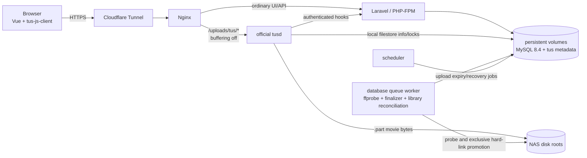
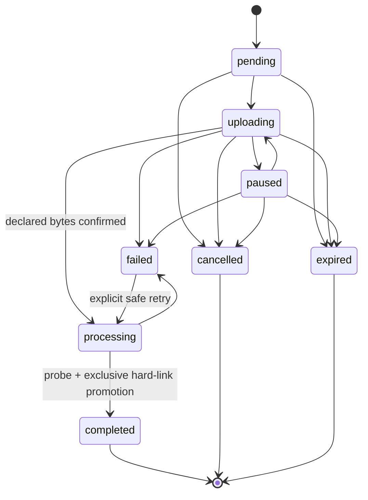

# Architecture

## 1. System context

Media Upload Manager separates control-plane traffic from movie bytes. Laravel owns identity, authorization, metadata, reservations, lifecycle state, and orchestration. The browser sends the file to `tusd` through a dedicated Nginx route; `tusd` writes directly to the selected NAS filesystem.



This split prevents PHP from receiving, buffering, assembling, or copying an entire movie. The [tus protocol](https://tus.io/protocols/resumable-upload) supplies offset-based resumability, and the deployment must follow `tusd`'s [reverse-proxy configuration guidance](https://tus.github.io/tusd/getting-started/configuration/#proxies).

## 2. Runtime topology

Production consists of:

| Service | Responsibility | Persistent access |
| --- | --- | --- |
| `nginx` | TLS-origin HTTP routing, normal proxy/FastCGI traffic, unbuffered tus route | Configuration only |
| `mysql` | MySQL 8.4 application, queue, cache, session, and Pulse state | Named database volume |
| `app` | Laravel HTTP application through PHP-FPM | MySQL; tus metadata; NAS roots for checks/path operations |
| `worker` | Database queue, `ffprobe`, finalization, retries | MySQL; tus metadata; read/write NAS roots |
| `scheduler` | Laravel scheduler for expiry and recovery | MySQL; tus metadata; read/write NAS roots |
| `pulse` | Long-running `pulse:check` server recorder | MySQL/cache |
| pinned `tusd` 2.10.0 | Resumable protocol, offsets, direct staging writes, and tus sidecar metadata | App-data volume for local filestore info/locks; read/write NAS roots for movie bytes |
| `cloudflared` | Outbound Cloudflare Tunnel connection | Tunnel token/config only |

MySQL and tus metadata use separate named Docker volumes. Loss of either volume is accepted state loss for this personal beta because backup and restoration are intentionally excluded. NAS roots are explicit read/write bind mounts shared at identical absolute paths by every service that touches them.

Cloudflare Free and Pro plans document a 100 MB maximum request size. The client therefore uses sequential 64 MiB PATCH requests, following Cloudflare's recommendation to split larger uploads; see its [HTTP 413 documentation](https://developers.cloudflare.com/support/troubleshooting/http-status-codes/4xx-client-error/error-413/). This is a chunk-request constraint, not a maximum movie size.

## 3. Request routing

### Application traffic

Nginx routes pages and `/api/*` to Laravel. Laravel provides the Inertia shell and authenticated JSON interfaces. Vue handles interactive search, path preview, disk selection, and upload state.

### Upload traffic

Nginx routes `/uploads/tus/*` to `tusd` only after a bodyless authorization subrequest, with request and response buffering disabled and the original scheme/host forwarded correctly. The external path must be configured consistently so `Location` headers remain same-origin HTTPS URLs.

Every production tus operation carries a short-lived bearer token issued by Laravel. Before Nginx proxies `POST`, `PATCH`, `HEAD`, or `DELETE` to `tusd`, an internal `auth_request`-style subrequest asks Laravel to prove that the token is valid, unexpired, hashed in storage, scoped to the current user/upload and operation, and consistent with the known length/disk. Only the small authorization subrequest reaches PHP; the movie request body does not. A `tusd` pre-create hook repeats creation validation and returns the trusted custom upload ID and local-filestore `Storage.Path`. Browser-supplied metadata never determines an unrestricted filesystem path.

`tusd` hooks call a separate internal Laravel interface through a service-authenticated, private-network route. If the selected `tusd` version cannot attach a static credential itself, an internal Nginx location adds the credential and is reachable only from the `tusd` network identity. Hook delivery is treated as at-least-once: creation, progress, termination, and completion handling are idempotent.

## 4. Upload sequence

```mermaid
sequenceDiagram
    actor U as User
    participant V as Vue app
    participant L as Laravel
    participant T as tusd
    participant D as Selected disk
    participant W as Queue worker

    U->>V: Select file and confirm TMDB result
    V->>L: Preview path and request disk status
    L-->>V: Eligible disks and recommendation
    V->>L: Create upload session
    L->>L: Lock, recheck, reserve, issue scoped token
    L-->>V: Session, token, tus endpoint
    V->>T: POST/PATCH in sequential 64 MiB chunks
    T->>L: Authenticated create/progress hooks
    T->>D: Write incoming/<uuid>.part
    T-->>V: Authoritative Upload-Offset
    T->>L: Completion hook
    L->>L: Reconcile exact length and mark processing
    W->>D: Check size and run ffprobe
    W->>D: Recheck target; exclusive hard link; unlink stage
    W->>L: Commit media file and completed status
    L-->>V: Completed final path
```

The pre-create response for the official local-disk store uses the documented [`ChangeFileInfo.Storage.Path`](https://tus.github.io/tusd/advanced-topics/hooks/#hook-requests-and-responses) override to set the binary object's staging path below. The tus information/lock files remain in `tusd`'s persistent local upload directory; they are small metadata, not a second movie copy. The staging path is always:

```text
<disk-root>/.media-upload-manager/incoming/<upload-uuid>.part
```

The finalized movie follows Jellyfin's [recommended naming layout](https://jellyfin.org/docs/general/server/media/movies/):

```text
<disk-root>/<title> (<year>) [tmdbid-<id>]/<title> (<year>) [tmdbid-<id>].<ext>
```

## 5. Resuming a transfer

`tus-js-client` uses:

- `chunkSize`: 64 MiB (`67,108,864` bytes);
- sequential chunks only; and
- retry delays: `0`, `3000`, `5000`, `10000`, and `20000` milliseconds.

The application persists a server-side upload session for seven days after last activity. Browser persistence for tus URLs, identifiers, files, fingerprints, and tokens is disabled; the database is authoritative.

For a same-browser reconnect, the client obtains a fresh token and queries the tus resource. After a browser restart, the user must reselect the file. The app matches name, size, last-modified time, and SHA-256 hashes for the first and last 1 MiB. Only then may it bind to the existing tus resource. `tusd`'s returned offset is authoritative and is reconciled to `uploads.confirmed_offset`.

A fresh login/token does not weaken the local-file match, and a matching fingerprint does not bypass authorization.

## 6. Domain model

### `users`

Extends the starter-kit user with:

- `is_administrator`;
- forced-credential-change state/timestamp; and
- disabled state/timestamp; and
- initial-credential issuance timestamp.

### `media_items`

Stores the confirmed identity and selected metadata snapshot:

- TMDB ID (unique identity for v1);
- optional IMDb ID;
- title, original title, release year/date, overview, poster reference, and language; and
- raw/versioned metadata snapshot where useful for audit/reprocessing; and
- a nullable unique current-media-file relation identifying the sole application-managed primary; and
- a nullable write-once deletion claim and request timestamp used to recover irreversible deletion.

Repeated confirmation of the same TMDB ID reuses the stored identity and snapshot unchanged. An existing identity without a current primary may admit a normal upload; one with a current primary requires the explicit MUM-011 replacement path.

### `media_files`

Represents a finalized physical file:

- media item and unique source-upload relations;
- stable disk ID;
- normalized relative path;
- byte size;
- container, duration, video/audio stream metadata, and probe snapshot; and
- completion timestamps; and
- historical replacement/removal fields.

A nullable unique active-path key enforces one live `(disk_id, relative_path)` owner while allowing historical replacement rows to retain the same disk and path. Replaced rows clear that key and remain as audit history; `media_items.current_media_file_id` identifies the sole current primary.

### `uploads`

Controls the transfer and its reservation:

- UUID, owner, and status;
- stable disk ID and immutable normalized target relative path;
- original filename and normalized extension;
- declared size and confirmed offset;
- fingerprint fields (name, size, modification time, first/last hashes);
- tus resource identity and staging relative path;
- token hash/scope/expiry, last activity, and inactivity expiry;
- confirmed TMDB/media-item relationship and optional explicitly confirmed replacement target;
- error code and safe error detail; and
- processing/idempotency timestamps.

The upload record does not store bearer tokens or arbitrary absolute paths from a client. Its public identity is a UUIDv7. Ownership, movie, replacement target, disk, paths, local-file fingerprint, and declared size are immutable after admission; tus identity is write-once and confirmed offsets are bounded and monotonic.

### `library_scans` and `library_findings`

An administrator-created `library_scans` row records queued/scanning/completed state, per-disk outcomes, discovered and missing counts, safe error detail, and timestamps. One scan snapshots the configured roots at a point in time; it is not a continuous index.

Each `library_findings` row records one discovered regular movie or one missing tracked current primary with:

- scan, stable disk ID, normalized relative path, source folder/name, and a unique path key;
- exact size/device/inode snapshot where bytes exist;
- optional media item/file and paired-missing-finding relations;
- proposed identity, identity source/snapshot, TMDB/IMDb IDs, and canonical destination;
- kind, lifecycle status, resolution, and timestamps; and
- a nullable write-once operation claim used for import, verified relocation, or exact deletion.

A finding's identity or filename is never sufficient byte provenance. Import and relocation claims pin every input needed for deterministic retry before mutation.

### `media_item_reidentifications`

One re-identification operation stores the administrator, media item, optional source media file/upload, immutable old/new metadata snapshots, exact disk/source/destination/size/device/inode claims, lifecycle state, safe failure detail, and completion timestamps. An unfinished operation fixes the retry target; it cannot be repurposed for a different identity.

### `folder_cleanups`

A cleanup stores the administrator and originating finding, exact disk/folder, canonical manifest plus SHA-256 manifest hash, file count and total bytes, lifecycle state, error detail, and confirmation/completion timestamps. The manifest identifies every file and directory by relative path, type, device, inode, and file size where applicable.

## 7. State machine



Transitions use compare-and-set semantics or a row lock. Repeated hooks and jobs become no-ops once their intended transition is already applied. Only nonterminal active states contribute remaining-byte reservations. The exact retry policy from `failed` is error-code dependent; unsafe conflicts are never auto-retried.

## 8. Capacity and disk safety

Disk definitions come from trusted environment configuration, not the database or request. Stable disk IDs are stored in records so label changes do not alter identity.

For each disk:

```text
active_remaining = SUM(MAX(declared_size - confirmed_offset, 0))
projected_usable = filesystem_free - safety_reserve
                   - active_remaining - proposed_upload_size
```

Session creation recalculates capacity and checks conflicts inside a transaction/lock to prevent concurrent overcommit in the expected low-concurrency deployment. Recommendation picks the eligible disk with the greatest nonnegative projected usable value; a user override passes the same validation.

Path handling must:

1. resolve and validate the configured root at startup/health check;
2. reject root paths, missing mounts, symlink escapes, and unexpected device changes where detectable;
3. build relative paths only through a centralized path builder;
4. verify that staging and destination resolve beneath the selected root;
5. avoid following client-controlled symlinks; and
6. use exclusive same-filesystem hard-link creation followed by unlinking the staging name so ordinary uploads cannot overwrite existing paths.

The application should fail closed when a bind mount is absent. It must not silently write into an empty directory on the container's local filesystem.

## 9. Authenticated interfaces

Exact URI names may be refined during implementation, but the contract contains:

| Interface | Operations |
| --- | --- |
| Movie lookup | Search by text; resolve TMDB ID; find by IMDb ID; retrieve detail |
| Path preview | Build canonical destination and report conflicts without mutation |
| Disk status | List label, health, free/reserved/projected bytes, reasons for ineligibility |
| Library scans | Administrator-only explicit scan, finding review, identity/import, verified restore, external-removal reconciliation, exact discovered-file deletion, and cleanup confirmation |
| Movie re-identification | Administrator-only preview and confirmation of an immutable old/new identity and canonical-path operation |
| `GET /uploads/resumable` | List the current user's active wizard-recovery sessions |
| `GET /uploads/{upload}` | Reconcile and return one safe owner/admin-scoped session |
| `POST /uploads/{upload}/authorization` | Validate the exact fingerprint, rotate the token, and return transport settings |
| `POST /uploads/{upload}/pause` | Record an explicit pause after the browser aborts its request |
| `DELETE /uploads/{upload}` | Cancel pending state or terminate an active tus resource; never cancel processing |
| Completion | Idempotently confirm/reconcile completion and queue processing |
| User administration | Planned MUM-013 administrator web workflows for create, reset, disable, and enable; CLI bootstrap/recovery exists |
| `GET /internal/tus/authorize` | Bodyless allow/deny subrequest for protected tus methods |
| `POST /internal/tus/hooks` | Secret-authenticated create, progress, completion, and termination hooks |

All browser JSON writes use normal Laravel session authentication and CSRF protection. Tus bearer tokens are distinct capabilities with minimal scope and short expiry. Internal hook credentials are distinct from both.

## 10. TMDB boundary

Laravel is the sole TMDB client, keeping `TMDB_API_TOKEN` out of browser assets. It maps upstream payloads to internal DTOs, caches suitable search/detail responses, applies bounded retry/backoff for transient failures, and returns stable application errors.

Text search and IMDb mapping follow TMDB's [finding-data documentation](https://developer.themoviedb.org/docs/finding-data). UI surfaces must retain required attribution and comply with current TMDB terms described in its [FAQ](https://developer.themoviedb.org/docs/faq).

## 11. Validation and atomic finalization

The worker performs this retry-safe sequence:

1. lock/reload the `processing` upload;
2. reconcile tus offset and physical staged-file size with declared size;
3. confirm the stage path and disk root are safe;
4. run `ffprobe` with a timeout and structured JSON output;
5. require at least one valid video stream and store selected technical metadata;
6. rebuild and recheck the final path and all database/filesystem conflicts;
7. create the final directory safely;
8. create the target with an exclusive same-filesystem hard link, verify the identical inode/size, and unlink the staging name; and
9. transactionally create `media_files`, mark the upload `completed`, release its reservation, and schedule safe tus metadata cleanup.

The persisted validation claim makes crash recovery deterministic for “stage only,” “both names with the same inode,” “final only,” and “database committed” combinations. Missing claims, different-inode targets, changed mounts, or contradictory records cause a visible failure and are never overwritten.

### Explicit current-primary replacement

MUM-011 is the only exception to ordinary no-overwrite behavior. Session admission must show the tracked current primary, require explicit confirmation, and persist the replacement relationship before transfer. Replacement runs only after the new upload reaches its declared size and passes `ffprobe` validation.

For a same-disk, same-path replacement, finalization atomically renames the validated new file over the tracked primary with no backup. For a cross-disk replacement, it finalizes the new primary first and then deletes only the old tracked primary. The old primary is unrecoverable after success. The workflow never recursively deletes the movie directory and never modifies Jellyfin artwork, metadata, subtitles, trickplay, or other operator-managed sidecars.

### Tracked movie deletion

MUM-011A inventories database records rather than scanning configured roots. A movie with a current primary may be deleted by that primary's source-upload owner or an administrator. An orphan with related uploads may be deleted by a nonadministrator only when every upload belongs to them; an ownerless orphan is administrator-only. The UI shows the movie and tracked disk, relative path, and byte size, then requires an explicit irreversible-warning checkbox before enabling deletion.

Deletion shares the global admission lock with upload reservation. Under that lock it reloads and locks the complete movie/upload/media-file graph, blocks every active or failed upload, rejects tus staging or metadata residue, validates replacement history, and rechecks the configured disk marker, guarded path, regular-file type, size, device, and inode. It then persists a write-once claim containing the exact physical identity before unlinking any bytes. New upload admission is blocked as soon as that claim exists.

A pre-claim missing, changed, symlinked, or offline primary fails closed and retains the database graph. After a valid claim exists, retry may accept the claimed primary as absent, allowing a crash after unlink to converge. The database transaction clears graph cycles, hard-deletes the related media-file and upload history, and finally deletes the movie only after proving the claimed path absent. Filesystem cleanup deletes only the exact claimed file and may remove its immediate movie directory only when proven empty; it never recurses or touches artwork, NFO metadata, subtitles, extras, trickplay, or other operator-managed sidecars. Credential-free confirmation and completion audit events survive the purge.

### Existing-library scan and canonical import

Only an administrator may create a scan. The queued scanner snapshots each currently healthy configured disk, excludes `.media-upload-manager` at the root and every depth, does not follow symlinks, and records supported regular video files. It also records a missing finding for each application-tracked current primary whose exact guarded path is absent. A scan itself never moves, links, unlinks, or adopts bytes.

Discovered identity resolution may use a Jellyfin TMDB marker or administrator-confirmed TMDB details, but import remains a separate explicit action. Before mutation, the worker rechecks disk health, path boundaries, the exact size/device/inode scan snapshot, duplicate identities, current primaries, uploads, canonical path conflicts, and `ffprobe`. It then persists a claim containing the actor, source snapshot, identity/media item, canonical destination, and probe result.

Import recovery accepts only source-only, both names with the claimed inode, destination-only, or database-committed states. It creates the canonical target with an exclusive same-filesystem hard link, verifies the inode/size, unlinks the discovered name, creates one immutable `media_files` row with import provenance, and marks the finding resolved. It never falls back to rename, copy, overwrite, or sidecar mutation.

### Missing-primary reconciliation and verified relocation

A missing finding retains the exact tracked media item/file and old disk/path/size. If exactly one same-scan discovered finding identifies that movie, the matcher attempts durable byte proof:

- an imported primary must match the original claimed size/device/inode provenance; or
- an uploaded primary must match its size and bounded first/last SHA-256 fingerprint ranges.

Filename, TMDB identity, or size alone never authorizes relocation. A successful match records the pair and exposes an explicit restore action. Under the shared admission lock, restore pins the discovered source snapshot, absent tracked path, canonical destination, old primary, and proof. The worker revalidates the proof, promotes the found inode to its canonical name with exclusive hard-link/unlink, creates a new immutable current `media_files` row, releases the old row with `relocation` history, and resolves both findings. Retries converge across source-only, both-linked, destination-only, and database-committed states.

When no paired relocation remains, an administrator may instead confirm external removal. The application rechecks a healthy disk and the exact tracked path under the admission lock, then releases the old primary and leaves the movie orphaned. If the path returned or a proven discovered pair exists, it refuses the reconciliation.

### Tracked-movie re-identification

Only an administrator may re-identify a movie. Preview rejects the same identity, a TMDB identity already owned by another movie, active/failed upload work, unsafe disk state, and occupied canonical targets. Confirmation shares the admission lock and creates one immutable `media_item_reidentifications` operation before mutation.

For an orphan, completion updates only the stored identity snapshot. For a movie with a current primary, the operation pins the source media file/upload, old/new metadata, disk, source/destination paths, and exact size/device/inode. It creates the new canonical path with an exclusive hard link, verifies both names are the claimed inode, unlinks the source name, releases the old media-file row as reidentified, creates a provenance-backed immutable replacement row, and removes the old directory only if empty. Retry must use the pinned identity and converges without touching sidecars.

### Exact discovered-file deletion and folder cleanup

An unresolved discovered finding may be deleted only by an administrator after an irreversible confirmation. The transaction rechecks the exact regular-file size/device/inode snapshot and ensures no active `media_files` row or nonterminal upload claims the path, then writes an immutable delete claim. The queued job unlinks only that claimed file. Before a claim, absence or change fails closed; after a claim, absence is a valid retry state, but a different file at the path is never accepted.

Once an import, relocation, or deletion resolves a finding, residue cleanup is a separate operation. Preview walks only the bounded old folder, refuses a configured root, supported video, symlink, special file, unsafe path, or unhealthy disk, and persists the exact file/directory manifest and canonical hash. The administrator must confirm that same hash. Processing rechecks every still-present entry's type/device/inode/size, deletes only manifest files and then empty manifest directories from the leaves upward, and reports `partial` if new residue prevents complete removal. New, changed, or unclaimed entries are retained; the workflow is not arbitrary browsing, bulk deletion, or general sidecar management.

## 12. Security model

- Public registration is removed; all functional routes require authentication.
- First-admin bootstrap is idempotent. Its random password is logged exactly once, is not placed in source or `.env`, and must be replaced with name/email changes.
- Login and recovery operations are rate-limited and audited.
- Administrators cannot retrieve existing passwords; the planned MUM-013 web reset will issue a new one-time credential, while beta.2 provides CLI recovery.
- Upload tokens are random/high-entropy, hashed at rest, short-lived, single-session, and revocable.
- Disk IDs, tus IDs, offsets, sizes, and hook payloads are validated server-side.
- Hook requests use an internal secret and replay/idempotency protection where the hook protocol permits.
- Logs redact passwords, API tokens, tunnel tokens, authorization headers, cookies, and local full paths where disclosure is unnecessary.
- Nginx limits the tus route to required protocol methods/headers and does not expose incoming directories.
- Production uses HTTPS, secure cookies, trusted-proxy configuration, and an explicit host policy.

## 13. Operations and recovery

- The scheduler checks inactive sessions every fifteen minutes and recovers processing uploads every five minutes. Expiry is allowed only after tus length, offset, guarded physical size, mount identity, and unchanged inactivity agree.
- Cleanup never deletes a staged/final file solely from untrusted client state.
- Reconciliation compares database state, tus metadata, and physical size after worker or `tusd` restarts.
- MySQL and tus metadata survive ordinary container recreation; destroying either named volume is accepted, unrecoverable beta data loss.
- Health checks cover database access, queue progress, `tusd`, `ffprobe`, each configured mount, and staging permissions.
- Structured logs include request/upload IDs and lifecycle transitions without secrets.
- Disk-full, mount-loss, invalid-video, target-conflict, token-expiry, and hook-lag states remain visible and actionable.

See [configuration.md](configuration.md) for the environment contract and operational warnings, and [backlog.md](backlog.md) for the implementation order.
