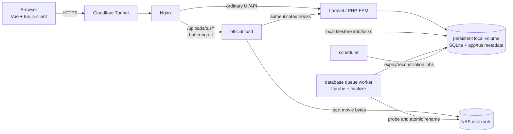
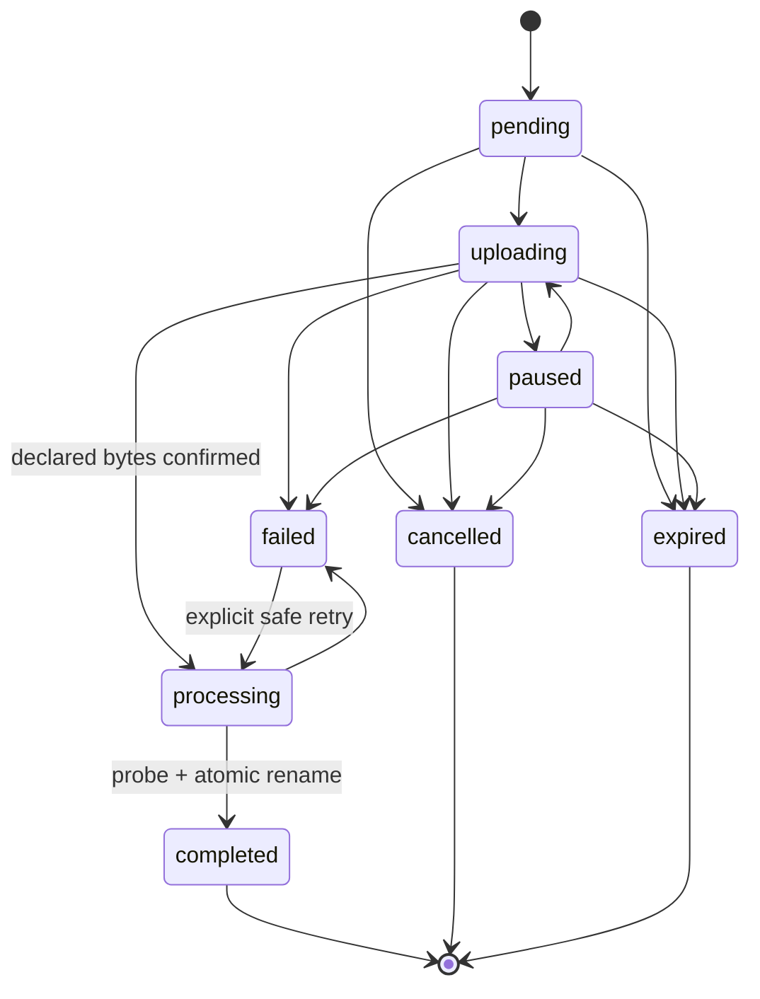

# Architecture

## 1. System context

Media Upload Manager separates control-plane traffic from movie bytes. Laravel owns identity, authorization, metadata, reservations, lifecycle state, and orchestration. The browser sends the file to `tusd` through a dedicated Nginx route; `tusd` writes directly to the selected NAS filesystem.



This split prevents PHP from receiving, buffering, assembling, or copying an entire movie. The [tus protocol](https://tus.io/protocols/resumable-upload) supplies offset-based resumability, and the deployment must follow `tusd`'s [reverse-proxy configuration guidance](https://tus.github.io/tusd/getting-started/configuration/#proxies).

## 2. Runtime topology

Production consists of:

| Service | Responsibility | Persistent access |
| --- | --- | --- |
| `nginx` | TLS-origin HTTP routing, normal proxy/FastCGI traffic, unbuffered tus route | Configuration only |
| `app` | Laravel HTTP application through PHP-FPM | SQLite/app-data volume; NAS roots for checks/path operations |
| `worker` | Database queue, `ffprobe`, finalization, retries | SQLite/app-data volume; read/write NAS roots |
| `scheduler` | Laravel scheduler for expiry, health, and reconciliation | SQLite/app-data volume; NAS roots as needed |
| `tusd` | Resumable protocol, offsets, direct staging writes, and tus sidecar metadata | SQLite/app-data volume for local filestore info/locks; read/write NAS roots for movie bytes |
| `cloudflared` | Outbound Cloudflare Tunnel connection | Tunnel token/config only |

SQLite, framework storage, and operational state use a persistent local Docker volume. NAS roots are explicit read/write bind mounts shared at identical container paths by every service that touches them. Production Compose provides three example mount slots; additional disks are added with a Compose override.

Cloudflare Free and Pro plans document a 100 MB maximum request size. The client therefore uses sequential 64 MiB PATCH requests, following Cloudflare's recommendation to split larger uploads; see its [HTTP 413 documentation](https://developers.cloudflare.com/support/troubleshooting/http-status-codes/4xx-client-error/error-413/). This is a chunk-request constraint, not a maximum movie size.

## 3. Request routing

### Application traffic

Nginx routes pages and `/api/*` to Laravel. Laravel provides the Inertia shell and authenticated JSON interfaces. Vue handles interactive search, path preview, disk selection, and upload state.

### Upload traffic

Nginx routes `/uploads/tus/*` to `tusd` only after a bodyless authorization subrequest, with request and response buffering disabled and the original scheme/host forwarded correctly. The external path must be configured consistently so `Location` headers remain same-origin HTTPS URLs.

Every production tus operation carries a short-lived bearer token issued by Laravel. Before Nginx proxies `POST`, `PATCH`, `HEAD`, or `DELETE` to `tusd`, an internal `auth_request`-style subrequest asks Laravel to prove that the token is valid, unexpired, hashed in storage, scoped to the current user/upload and operation, and consistent with the known length/disk. Only the small authorization subrequest reaches PHP; the movie request body does not. A `tusd` pre-create hook repeats creation validation and returns the trusted custom upload ID and local-filestore `Storage.Path`. Browser-supplied metadata never determines an unrestricted filesystem path.

`tusd` hooks call a separate internal Laravel interface through a service-authenticated, private-network route. If the selected `tusd` version cannot attach a static credential itself, an internal Nginx location adds the credential and is reachable only from the `tusd` network identity. Hook delivery is treated as at-least-once: creation, progress, termination, and completion handling are idempotent.

## 4. Upload sequence

```mermaid
sequenceDiagram
    actor U as User
    participant V as Vue app
    participant L as Laravel
    participant T as tusd
    participant D as Selected disk
    participant W as Queue worker

    U->>V: Select file and confirm TMDB result
    V->>L: Preview path and request disk status
    L-->>V: Eligible disks and recommendation
    V->>L: Create upload session
    L->>L: Lock, recheck, reserve, issue scoped token
    L-->>V: Session, token, tus endpoint
    V->>T: POST/PATCH in sequential 64 MiB chunks
    T->>L: Authenticated create/progress hooks
    T->>D: Write incoming/<uuid>.part
    T-->>V: Authoritative Upload-Offset
    T->>L: Completion hook
    L->>L: Idempotently mark processing and enqueue
    W->>D: Check size and run ffprobe
    W->>D: Recheck target; atomic rename
    W->>L: Commit media file and completed status
    L-->>V: Completed final path
```

The pre-create response for the official local-disk store uses the documented [`ChangeFileInfo.Storage.Path`](https://tus.github.io/tusd/advanced-topics/hooks/#hook-requests-and-responses) override to set the binary object's staging path below. The tus information/lock files remain in `tusd`'s persistent local upload directory; they are small metadata, not a second movie copy. The staging path is always:

```text
<disk-root>/.media-upload-manager/incoming/<upload-uuid>.part
```

The finalized movie follows Jellyfin's [recommended naming layout](https://jellyfin.org/docs/general/server/media/movies/):

```text
<disk-root>/<title> (<year>) [tmdbid-<id>]/<title> (<year>) [tmdbid-<id>].<ext>
```

## 5. Resuming a transfer

`tus-js-client` uses:

- `chunkSize`: 64 MiB (`67,108,864` bytes);
- sequential chunks only; and
- retry delays: `0`, `3000`, `5000`, `10000`, and `20000` milliseconds.

The application persists a server-side upload session for seven days after last activity. The browser may keep only a convenience session identifier; the database is authoritative.

For a same-browser reconnect, the client obtains a fresh token and queries the tus resource. After a browser restart, the user must reselect the file. The app matches name, size, last-modified time, and SHA-256 hashes for the first and last 1 MiB. Only then may it bind to the existing tus resource. `tusd`'s returned offset is authoritative and is reconciled to `uploads.confirmed_offset`.

A fresh login/token does not weaken the local-file match, and a matching fingerprint does not bypass authorization.

## 6. Domain model

### `users`

Extends the starter-kit user with:

- `is_administrator`;
- forced-credential-change state/timestamp; and
- disabled state/timestamp; and
- initial-credential issuance timestamp.

### `media_items`

Stores the confirmed identity and selected metadata snapshot:

- TMDB ID (unique identity for v1);
- optional IMDb ID;
- title, original title, release year/date, overview, poster reference, and language; and
- raw/versioned metadata snapshot where useful for audit/reprocessing; and
- a nullable unique current-media-file relation identifying the sole application-managed primary.

Repeated confirmation of the same TMDB ID reuses the stored identity and snapshot unchanged. An existing identity without a current primary may admit a normal upload; one with a current primary requires the explicit MUM-011 replacement path.

### `media_files`

Represents a finalized physical file:

- media item and unique source-upload relations;
- stable disk ID;
- normalized relative path;
- byte size;
- container, duration, video/audio stream metadata, and probe snapshot; and
- completion timestamps; and
- historical replacement/removal fields.

A `(disk_id, relative_path)` uniqueness rule is required. Replaced rows remain as audit history; `media_items.current_media_file_id` identifies the sole current primary.

### `uploads`

Controls the transfer and its reservation:

- UUID, owner, and status;
- stable disk ID and immutable normalized target relative path;
- original filename and normalized extension;
- declared size and confirmed offset;
- fingerprint fields (name, size, modification time, first/last hashes);
- tus resource identity and staging relative path;
- token hash/scope/expiry, last activity, and inactivity expiry;
- confirmed TMDB/media-item relationship and optional explicitly confirmed replacement target;
- error code and safe error detail; and
- processing/idempotency timestamps.

The upload record does not store bearer tokens or arbitrary absolute paths from a client. Its public identity is a UUIDv7. Ownership, movie, replacement target, disk, paths, local-file fingerprint, and declared size are immutable after admission; tus identity is write-once and confirmed offsets are bounded and monotonic.

## 7. State machine



Transitions use compare-and-set semantics or a row lock. Repeated hooks and jobs become no-ops once their intended transition is already applied. Only nonterminal active states contribute remaining-byte reservations. The exact retry policy from `failed` is error-code dependent; unsafe conflicts are never auto-retried.

## 8. Capacity and disk safety

Disk definitions come from trusted environment configuration, not the database or request. Stable disk IDs are stored in records so label changes do not alter identity.

For each disk:

```text
active_remaining = SUM(MAX(declared_size - confirmed_offset, 0))
projected_usable = filesystem_free - safety_reserve
                   - active_remaining - proposed_upload_size
```

Session creation recalculates capacity and checks conflicts inside a transaction/lock to prevent concurrent overcommit in the expected low-concurrency deployment. Recommendation picks the eligible disk with the greatest nonnegative projected usable value; a user override passes the same validation.

Path handling must:

1. resolve and validate the configured root at startup/health check;
2. reject root paths, missing mounts, symlink escapes, and unexpected device changes where detectable;
3. build relative paths only through a centralized path builder;
4. verify that staging and destination resolve beneath the selected root;
5. avoid following client-controlled symlinks; and
6. use exclusive creation/rename behavior so ordinary uploads cannot overwrite existing paths.

The application should fail closed when a bind mount is absent. It must not silently write into an empty directory on the container's local filesystem.

## 9. Authenticated interfaces

Exact URI names may be refined during implementation, but the contract contains:

| Interface | Operations |
| --- | --- |
| Movie lookup | Search by text; resolve TMDB ID; find by IMDb ID; retrieve detail |
| Path preview | Build canonical destination and report conflicts without mutation |
| Disk status | List label, health, free/reserved/projected bytes, reasons for ineligibility |
| Upload sessions | Create, list, view, cancel; only owner or administrator may access |
| Resume authorization | Validate fingerprint and issue a fresh scoped token |
| Completion | Idempotently confirm/reconcile completion and queue processing |
| User administration | Administrator-only create, reset, disable, and enable |
| Internal tus hooks | Authenticate service; handle create, progress, completion, termination, reconciliation |

All browser JSON writes use normal Laravel session authentication and CSRF protection. Tus bearer tokens are distinct capabilities with minimal scope and short expiry. Internal hook credentials are distinct from both.

## 10. TMDB boundary

Laravel is the sole TMDB client, keeping `TMDB_API_TOKEN` out of browser assets. It maps upstream payloads to internal DTOs, caches suitable search/detail responses, applies bounded retry/backoff for transient failures, and returns stable application errors.

Text search and IMDb mapping follow TMDB's [finding-data documentation](https://developer.themoviedb.org/docs/finding-data). UI surfaces must retain required attribution and comply with current TMDB terms described in its [FAQ](https://developer.themoviedb.org/docs/faq).

## 11. Validation and atomic finalization

The worker performs this retry-safe sequence:

1. lock/reload the `processing` upload;
2. reconcile tus offset and physical staged-file size with declared size;
3. confirm the stage path and disk root are safe;
4. run `ffprobe` with a timeout and structured JSON output;
5. require at least one valid video stream and store selected technical metadata;
6. rebuild and recheck the final path and all database/filesystem conflicts;
7. create the final directory safely;
8. atomically rename the stage file on the same filesystem without overwrite; and
9. transactionally create `media_files`, mark the upload `completed`, release its reservation, and schedule safe tus metadata cleanup.

Crash recovery distinguishes “stage exists,” “final exists,” and “database committed” combinations. A final file with the expected upload identity/size can be reconciled; ambiguous files cause a visible failure and are never overwritten.

### Explicit current-primary replacement

MUM-011 is the only exception to ordinary no-overwrite behavior. Session admission must show the tracked current primary, require explicit confirmation, and persist the replacement relationship before transfer. Replacement runs only after the new upload reaches its declared size and passes `ffprobe` validation.

For a same-disk, same-path replacement, finalization atomically renames the validated new file over the tracked primary with no backup. For a cross-disk replacement, it finalizes the new primary first and then deletes only the old tracked primary. The old primary is unrecoverable after success. The workflow never recursively deletes the movie directory and never modifies Jellyfin artwork, metadata, subtitles, trickplay, or other operator-managed sidecars.

## 12. Security model

- Public registration is removed; all functional routes require authentication.
- First-admin bootstrap is idempotent. Its random password is logged exactly once, is not placed in source or `.env`, and must be replaced with name/email changes.
- Login and recovery operations are rate-limited and audited.
- Administrators cannot retrieve existing passwords; reset issues a new one-time credential.
- Upload tokens are random/high-entropy, hashed at rest, short-lived, single-session, and revocable.
- Disk IDs, tus IDs, offsets, sizes, and hook payloads are validated server-side.
- Hook requests use an internal secret and replay/idempotency protection where the hook protocol permits.
- Logs redact passwords, API tokens, tunnel tokens, authorization headers, cookies, and local full paths where disclosure is unnecessary.
- Nginx limits the tus route to required protocol methods/headers and does not expose incoming directories.
- Production uses HTTPS, secure cookies, trusted-proxy configuration, and an explicit host policy.

## 13. Operations and recovery

- The scheduler expires inactive sessions after seven days and releases reservations idempotently.
- Cleanup never deletes a staged/final file solely from untrusted client state.
- Reconciliation compares database state, tus metadata, and physical size after worker or `tusd` restarts.
- SQLite and application storage are backed up consistently; NAS media backups are a separate operator responsibility.
- Health checks cover database access, queue progress, `tusd`, `ffprobe`, each configured mount, and staging permissions.
- Structured logs include request/upload IDs and lifecycle transitions without secrets.
- Disk-full, mount-loss, invalid-video, target-conflict, token-expiry, and hook-lag states remain visible and actionable.

See [configuration.md](configuration.md) for the environment contract and operational warnings, and [backlog.md](backlog.md) for the implementation order.
